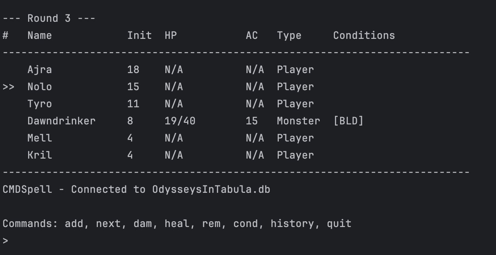

# CMDSpell
CMDSpell (pronounced Command Spell) is a CLI-based Dungeons & Dragons initiative tracker powered by SQLite. It helps keep track of initiative order, player/monster status, HP, AC, conditions, and damage history (including damage types).

## Dependencies
- Python 3.6+
- SQLite
## Installation
Simply download `main.py` and run it:
```bash
python3 main.py
```
If multiple `.db` files are present in the directory, you will be prompted to select one. Otherwise, it defaults to `combat.db`.

## Features
- Track initiative order
- Track HP and armour class of monsters
- Track conditions (e.g., Prone, Stunned)
- Track damage history (including damage types)
- Track rounds of combat
- Saves encounter data to `.db` file
- Supports multiple `.db` files (default: `combat.db`)
- Auto applies bloodied, critical, and dead conditions
- Lightweight
- Cross-platform
## Demo

## Usage
The application runs in an interactive loop. Available commands:

- `add`: Add a new combatant. For players, you can skip HP and AC tracking.
- `next`: Advance to the next turn in the initiative order.
- `dam`: Apply damage to a combatant and record the damage type.
- `heal`: Restore HP to a combatant.
- `rem`: Remove a combatant from the tracker.
- `cond`: Manage conditions (e.g., `add` or `rem` conditions like Prone, Stunned).
- `history`: View the damage and healing history of a specific combatant.
- `quit`: Exit the application.

## Contributing
Pull requests will not be accepted. This is a personal project that was created as a one-time haha funny joke in response to "autistic ways to track initiative" and despite being a project I am proud of, I do not intend to have others developing it.

## Acknowledgements
- [D&D 5e SRD](https://dnd5e.wikidot.com/)
- Michael the DM for inspiration
- [Stack Overflow](https://stackoverflow.com/) for code snippets and inspiration
- Oregon Tech D&D Club for even getting me into D&D